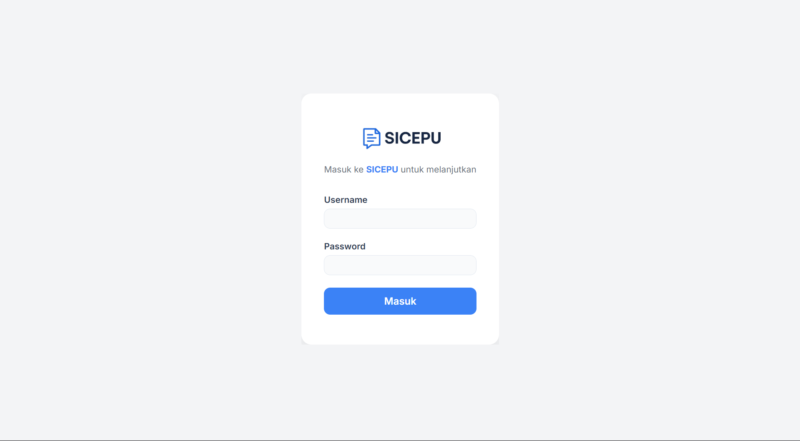
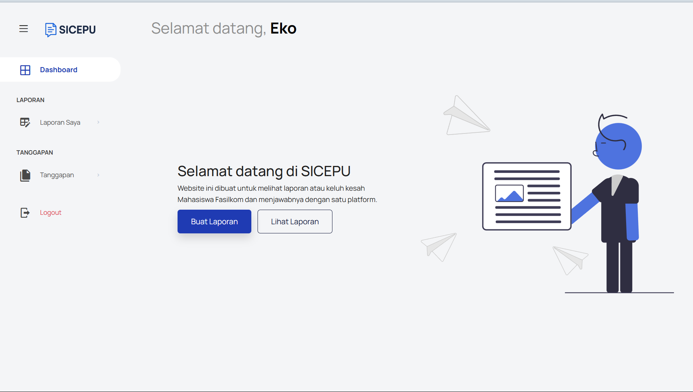

<h1 align="center">🎓 SICEPU – Sistem Informasi Pengaduan Mahasiswa</h1>

<p align="center">💬 Aplikasi berbasis web untuk memudahkan mahasiswa menyampaikan keluhan atau pengaduan ke pihak kampus. Dibuat dengan cinta oleh Satrio. 💻❤️</p>
<p align="center">LINK : http://sicepu.infinityfreeapp.com/</p>
<p align="center">
  
  
  
</p>

---

## 🚀 Fitur Utama

✨ SICEPU hadir untuk mempermudah pengelolaan pengaduan mahasiswa secara digital.

- 📝 Form pengaduan lengkap (nama, NIM, isi laporan, unggah foto)
- 📂 Upload bukti pengaduan (gambar/dokumen)
- 📊 Tampilkan daftar laporan yang sudah dikirim
- 🔐 Sistem login (jika dikembangkan lebih lanjut)
- 🛠️ CRUD data pengaduan untuk admin (opsional)
- 🧼 Validasi data input

---

## 📷 Preview Aplikasi



---

## 🛠️ Teknologi yang Digunakan

```text
🧠 Backend  : PHP Native
💾 Database : MySQL
🎨 Frontend : HTML, CSS, JavaScript
🖌️ Styling  : Bootstrap / SCSS
📂 Upload   : File handler PHP

```
## 📁 Struktur Project
```text
SICEPU/
├── assets/         # File CSS, JS, gambar, ikon
├── db/             # File konfigurasi database
├── public/         # Frontend publik (jika dipisah)
├── src/            # Logika backend PHP
├── uploads/        # Folder unggahan user
├── index.php       # Halaman utama
└── README.md       # Dokumentasi project
```

## ⚙️ Instalasi

### 1. Clone Repo
```text
git clone https://github.com/Ekosattrio/SICEPU.git
cd SICEPU
```
### 2. Setup Database
```text
- Buka phpMyAdmin / MySQL CLI
- Buat database baru (laporan_pengaduan)
- Import file SQL dari folder db/
```
###  3. Jalankan Project
```text
php -S localhost:8000
# atau akses via XAMPP di http://localhost/SICEPU
```

## kontributor
| Nama                      | Peran                               |
| ------------------------- | ----------------------------------- |
| 🧑‍🎓 Satrio (Ekosattrio) | Developer utama, Saya yang mengerjakan Semuanya |

## KONTAK
- 📧 Email  : ekosatriohandoyop@gmail.com
- 🌐 GitHub : https://github.com/Ekosattrio
- 🎓 Kampus : Universitas Singaperbangsa Karawang


